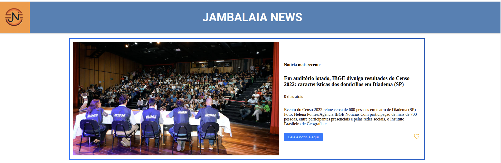
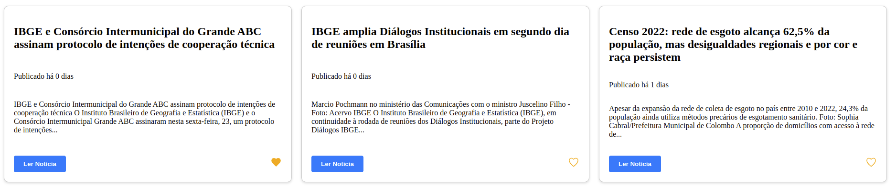

# Jambalaia News

## Descrição

Este projeto é uma aplicação de página de notícias que utiliza a API gratuita do IBGE para buscar informações. A página principal destaca a notícia mais recente. Além disso, a aplicação possui um sistema de favoritos, permitindo que os usuários marquem as notícias de seu interesse. As notícias favoritas são armazenadas localmente, possibilitando que o usuário as acesse posteriormente.

A aplicação foi testada para reduzir a possibilidade de problemas de funcionamento, garantindo uma experiência de usuário suave e confiável.

A barra de navegação oferece quatro filtros: notícias mais recentes (padrão), releases, notícias e uma opção para exibir todas as notícias marcadas como favoritas. Há também um campo de pesquisa por título para facilitar a busca por notícias específicas.

## Estrutura do Projeto

A estrutura do projeto organiza os componentes em pastas específicas, como components, hooks e images. Cada componente possui seu próprio diretório contendo o arquivo de código e um arquivo de estilo (quando aplicável). O uso de estilos modulares facilita a manutenção e compreensão do design.

## Componentes

### App

O componente principal App gerencia o estado do botão ativo e o valor de pesquisa. Ele decide qual conteúdo renderizar com base nesses estados, incluindo os componentes Header, LatestNews, NavigationMenu, SearchBar, e o conteúdo dinâmico conforme a escolha do usuário.

### Header

O componente Header exibe o logotipo e o título da aplicação.

### LatestNews

O componente LatestNews destaca a notícia mais recente, exibindo uma imagem, título, resumo e botões para abrir a notícia completa e adicionar/remover dos favoritos.

### NavigationMenu

O componente NavigationMenu oferece botões de navegação para filtrar notícias por categorias, como "Mais recentes", "Releases", "Notícias" e "Favoritas".

### NewsSection

O componente NewsSection exibe uma seção de notícias padrão, mostrando várias notícias em cards, com botões para abrir a notícia completa e adicionar/remover dos favoritos.

### NoticeSection

O componente NoticeSection exibe notícias específicas do tipo "Notícia", permitindo a navegação e interação semelhante ao NewsSection.

### ReleaseSection

O componente ReleaseSection exibe notícias específicas do tipo "Release", permitindo a navegação e interação semelhante ao NewsSection.

### FavoriteSection

O componente FavoriteSection exibe as notícias marcadas como favoritas, permitindo a navegação e interação semelhante ao NewsSection.

### SearchedNews

O componente SearchedNews exibe notícias filtradas por um termo de pesquisa, permitindo a navegação e interação semelhante ao NewsSection.

## Uso de Hooks Personalizados

### useFetchIBGENews

O hook useFetchIBGENews gerencia a chamada à API do IBGE para obter dados de notícias. Ele fornece os dados recuperados e um indicador de carregamento.

### useFavorites

O hook useFavorites gerencia as notícias marcadas como favoritas, armazenando-as no localStorage. Ele oferece funções para adicionar, remover e verificar se uma notícia é favorita.

## Pré-requisitos

Antes de começar, certifique-se de ter as seguintes ferramentas instaladas em sua máquina:

- [Node.js](https://nodejs.org/en/download/)
- [npm](https://www.npmjs.com/get-npm)

## Tecnologias Usadas

Este projeto foi desenvolvido com as seguintes tecnologias:

- [React](https://reactjs.org/): Uma biblioteca JavaScript para construir interfaces de usuário
- [Vite](https://vitejs.dev/): Uma ferramenta de construção que visa fornecer um ambiente de desenvolvimento mais rápido e eficiente
- [Vitest](https://vitest.dev/): Uma ferramenta de teste para Vite, projetada para testes de unidade e integração
- [React Testing Library](https://testing-library.com/docs/react-testing-library/intro/): Uma biblioteca de teste muito leve para React que fornece métodos para testar seus componentes de maneira a se aproximar o máximo possível de como seus usuários usariam seus aplicativos

## Instruções de Execução

1. Clone o repositório: `git clone https://github.com/luccas-santos01/jambalaia-news.git`
2. Instale as dependências: `npm install`
3. Inicie o aplicativo: `npm run dev`

## Deploy

Você pode acessar a aplicação implantada [aqui](https://luccas-santos01.github.io/jambalaia-news/).
